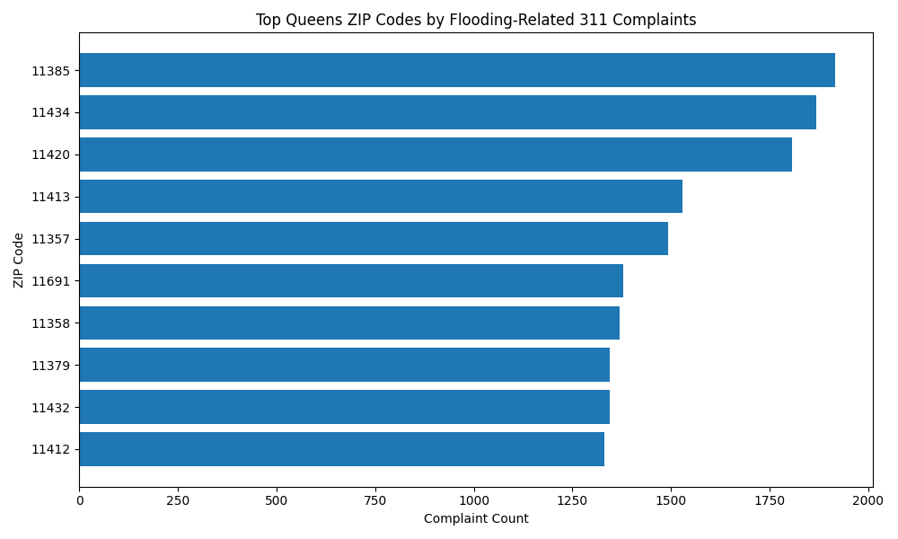
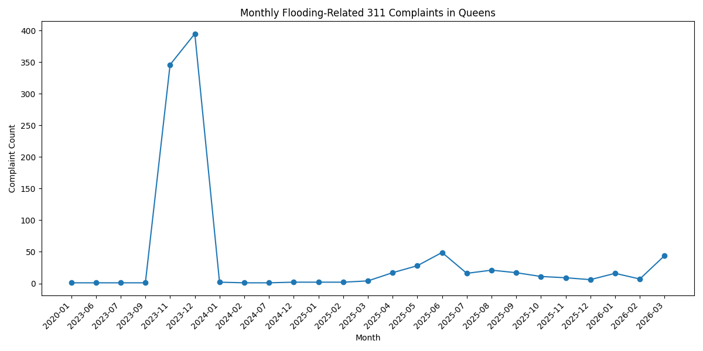
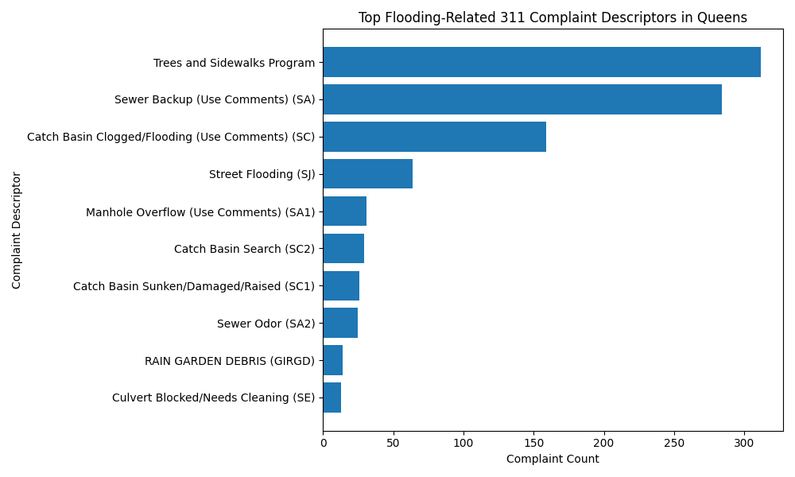

# Queens Flooding 311 Analysis

A small Python ETL and analysis project using NYC Open Data 311 service request records to examine flooding-related complaints in Queens, New York.

This project extracts public 311 complaint data, filters for Queens flooding-related records, cleans and validates the data, creates aggregate summary tables, generates charts, and writes a short findings report.

## Project Question

Where and when are flooding-related 311 complaints concentrated in Queens, and what data quality limitations should analysts consider when using 311 complaint data?

## Motivation

Flooding affects quality of life, infrastructure, transportation, housing, and public safety. Public complaint data can help identify patterns in reported flooding issues, but 311 records are administrative reports rather than direct measurements of flood severity. This project explores how such data can be cleaned, summarized, and interpreted responsibly.

## Data Source

This project uses NYC Open Data 311 service request records from 2020 to the present.

The extraction query filters for:

* records where `borough = 'QUEENS'`;
* complaint types or descriptors containing flood-related terms;
* selected fields related to complaint timing, location, status, descriptor, and resolution.

The query used for extraction is stored in:

```text
sql/queens_flooding_311_query.sql
```

## Methodology

The project follows a reproducible ETL and analysis workflow:

1. Extract Queens flooding-related 311 records from NYC Open Data.
2. Save the raw dataset.
3. Clean and normalize fields such as dates, ZIP codes, borough names, coordinates, statuses, and descriptors.
4. Create validation flags for missing or questionable records.
5. Aggregate complaint records by ZIP code, month, and complaint descriptor.
6. Generate charts showing complaint patterns.
7. Write a summary report describing findings, data quality notes, and limitations.

## Repository Structure

```text
queens-flooding-311-analysis/
  README.md
  requirements.txt
  .gitignore

  src/
    config.py
    extract.py
    transform.py
    validate.py
    analyze.py
    report.py
    main.py

  sql/
    queens_flooding_311_query.sql

  data/
    raw/
      queens_flooding_raw.csv
    processed/
      queens_flooding_cleaned.csv
      queens_flooding_validation_summary.csv
      queens_flooding_by_zip.csv
      queens_flooding_by_month.csv
      queens_flooding_by_descriptor.csv

  outputs/
    charts/
      complaints_by_zip.png
      complaints_by_month.png
      complaints_by_descriptor.png
    summary.md
```

## Outputs

The pipeline produces:

* a raw CSV of extracted 311 records;
* a cleaned CSV with normalized fields and validation flags;
* a validation summary showing missing or questionable values;
* aggregate tables by ZIP code, month, and complaint descriptor;
* charts showing complaint patterns;
* a written summary report.

## Charts

### Top Queens ZIP Codes by Flooding-Related 311 Complaints



### Monthly Flooding-Related 311 Complaint Trend



### Top Flooding-Related Complaint Descriptors



## Data Quality Checks

The cleaning process creates flags for:

* missing created dates;
* missing closed dates;
* missing ZIP codes;
* missing latitude or longitude;
* closed dates that appear earlier than created dates;
* duplicate complaint identifiers;
* coordinates outside broad reasonable NYC bounds;
* records usable for location-based analysis;
* records usable for time-based analysis.

These records are preserved rather than automatically removed so that analysts can decide how to handle them depending on the research question.

## Limitations

311 complaints are not direct measurements of flooding severity. Complaint volume may reflect actual flooding conditions, but it may also be affected by:

* population density;
* duplicate reports;
* neighborhood-level reporting behavior;
* awareness of 311;
* access to reporting tools;
* agency classification practices;
* differences between reported flooding and actual flood risk.

This project should therefore be interpreted as an analysis of reported flooding-related complaints, not as a complete measure of flood risk, flood damage, or infrastructure failure.

## How to Run

Create and activate a virtual environment:

```bash
python -m venv .venv
source .venv/bin/activate
```

Install dependencies:

```bash
pip install -r requirements.txt
```

Run the pipeline from the project root:

```bash
python src/main.py
```

Or, if running from inside the `src` folder:

```bash
python main.py
```

## Main Dependencies

* pandas
* sodapy
* matplotlib

## Relevance

This project demonstrates a concise public-interest data workflow using Python:

* extracting public data from an API;
* separating query logic into a SQL/SoQL file;
* cleaning messy administrative records;
* creating validation and data quality flags;
* producing aggregate analysis outputs;
* generating visualizations;
* communicating findings and limitations clearly.

The project is intended as a code sample for data ETL, analysis, and public-interest investigative analytics work.